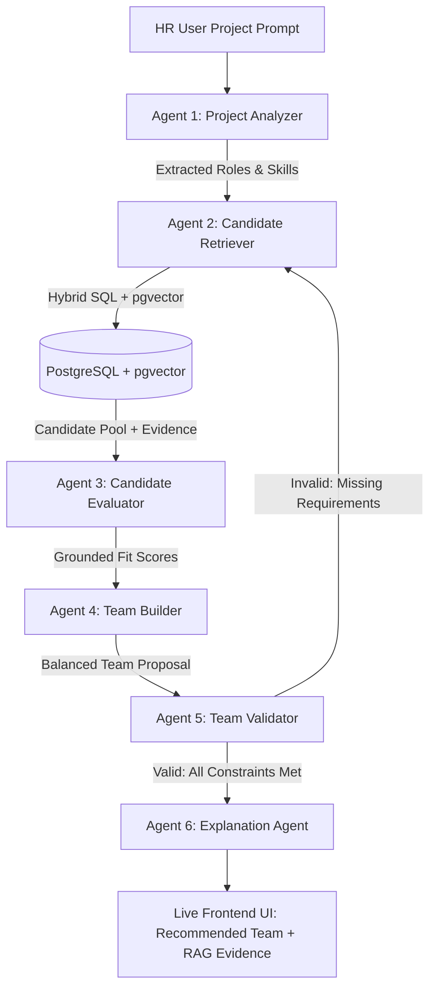

# AI-Powered Employee Team Builder
**Agentic AI + RAG System for Intelligent Project Team Formation**

[](https://github.com/pgvector/pgvector)
[](https://fastapi.tiangolo.com)
[](https://github.com/langchain-ai/langgraph)
[](https://nextjs.org)

---

## 1. Problem

Traditional Applicant Tracking Systems (ATS) and HR resume search engines rely on simple keyword filtering or naive vector similarity search. When given a complex project specification:

> *"Build an AI-powered customer support platform using React, FastAPI, PostgreSQL and AWS. The project requires a team of 6 people with a technical lead, two backend developers, one frontend developer, one ML engineer, and one QA engineer."*

Standard semantic search simply retrieves the top candidates with highest cosine similarity to the entire paragraph. This leads to severe structural failures:
- Compounding redundancies (e.g., returning 4 backend developers and 0 QA engineers).
- Missing critical non-functional roles (e.g., lack of technical leadership).
- Hallucinated qualifications not grounded in actual project achievements.
- Zero holistic team synergy or role constraint validation.

---

## 2. Solution

This project implements an **Agentic AI + Hybrid RAG system** that treats team building as a multi-stage reasoning and optimization problem rather than a single database lookup.

Key differentiators:
1. **Multi-Format Ingestion**: Parses PDF (PyMuPDF), DOCX (`python-docx`), and image resumes (PNG/JPG/WEBP via Gemini Vision) into structured relational profiles and semantic chunks.
2. **Hybrid RAG Pipeline**: Combines SQL relational filtering (`employee_skills`, `roles`, `years_experience`) with dense 384-dimensional vector similarity (`pgvector` cosine distance `<=>`).
3. **Multi-Stage LangGraph Workflow**: Six distinct, real agents coordinate to analyze requirements, retrieve candidates, evaluate profiles without hallucination, compose balanced teams, and validate constraints.
4. **Autonomous Loop Control**: If the composed team fails validation (e.g., missing QA or AWS experience), the workflow automatically loops back to retrieval with targeted requirements (up to 3 iterations).
5. **Grounded Explainability**: Every selected team member includes verifiable, expandable RAG evidence snippets taken directly from verified resume chunks.

---

## 3. Architecture



---

## 4. RAG Pipeline

```text
Document (PDF/DOCX/Image)
       ↓
Resume Parser (PyMuPDF / python-docx / Gemini Vision)
       ↓
Raw Text & Structured Extraction (Gemini LLM)
       ↓
PostgreSQL Relational Schema (Employees, Skills, Projects)
       ↓
Semantic Chunking (Profile Summary, Project Experience, Technical Skills)
       ↓
Embedding Generator (384-dimensional dense vectors)
       ↓
pgvector Storage (`document_chunks` with <=> Cosine Operator)
       ↓
Hybrid Retrieval Engine (SQL Filter + Vector Cosine Search)
```

- **Skill Normalization**: Alias dictionary standardizes synonyms (e.g., `ReactJS` → `React`, `Postgres` → `PostgreSQL`, `AWS Cloud` → `AWS`).
- **Verbatim Grounding**: Every recommendation retains the exact source snippet that justified selection.

---

## 5. Agentic Workflow (LangGraph)

| Agent Node | Responsibility | Output |
| :--- | :--- | :--- |
| **1. Project Analyzer** | Deconstructs natural language into structured JSON requirements | Roles, Headcounts, Mandatory Skills, Domain |
| **2. Candidate Retriever** | Queries database via hybrid RAG (SQL + pgvector) | 10–14 candidates with verbatim evidence snippets |
| **3. Candidate Evaluator** | Calculates grounded fit scores (role, skill, experience, domain) | Zero-hallucination scorecards, strengths & gaps |
| **4. Team Builder** | Combinatorial whole-team optimizer maximizing coverage | Balanced team of exact target size |
| **5. Team Validator** | Validates headcount, role fulfillment, and skill coverage | Valid bool, missing requirements, loop trigger |
| **6. Explanation Agent** | Synthesizes evidence-backed justifications & team checklist | Per-member reasoning, team strengths summary |

---

## 6. Database Design

Implemented in PostgreSQL 17 with `pgvector`:

- `employees`: Core employee records (`id`, `name`, `email`, `role`, `department`, `years_experience`, `resume_text`).
- `skills`: Normalized technical skill registry.
- `employee_skills`: Link table with proficiency (`beginner`, `intermediate`, `advanced`, `expert`) and years.
- `projects`: Past project catalog (`id`, `name`, `description`, `domain`).
- `employee_projects`: Past projects undertaken by employees.
- `document_chunks`: RAG chunk store with `embedding vector(384)` and `metadata_json`.

---

## 7. Technologies

- **Backend**: Python 3.11, FastAPI, SQLAlchemy 2.0, PostgreSQL 17, `pgvector`, Pydantic v2, LangGraph, PyMuPDF (`fitz`), `python-docx`, Pillow, `google-genai`.
- **Frontend**: Next.js 15 (App Router), TypeScript, Tailwind CSS, Lucide Icons, Axios.
- **Infrastructure**: Docker, Docker Compose, multi-stage builds.

---

## 8. Directory Structure

```text
.
├── docker-compose.yml        # Orchestrates db, pgadmin, backend, frontend
├── .gitignore
├── README.md
├── dbms/                     # Database setup
│   ├── .env                  # PostgreSQL credentials
│   ├── init.sql              # CREATE EXTENSION vector; initial DDL
│   └── README.md
├── backend/                  # FastAPI + LangGraph Backend
│   ├── Dockerfile
│   ├── requirements.txt
│   ├── start.sh              # Auto-seeds & starts uvicorn
│   ├── seed.py               # 18 diverse pre-seeded fictional candidates
│   ├── uploads/              # Document storage volume
│   └── app/
│       ├── main.py           # FastAPI app & CORS middleware
│       ├── core/config.py    # Pydantic BaseSettings
│       ├── db/               # SQLAlchemy engine & models
│       ├── schemas/          # Pydantic schemas
│       ├── rag/              # Ingestion, parser, embeddings, retrieval
│       ├── agents/           # 6 LangGraph agent nodes & workflow
│       ├── services/         # Employee & team services
│       └── routers/          # API endpoints
└── frontend/                 # Next.js App Router Frontend
    ├── Dockerfile            # Multi-stage production runner
    ├── package.json
    ├── next.config.ts
    └── src/
        ├── app/              # Dashboard, Employees, Team Builder
        ├── components/       # AgentWorkflow, TeamMemberCard, SkillCoverage, etc.
        ├── lib/              # Axios client & utilities
        └── services/         # API & SSE streaming services
```

---

## 9. Setup & Running

### Option A: Docker Compose (Recommended)

1. Clone or navigate to the project directory:
   ```bash
   cd /home/urmum/Documents/college/resume
   ```

2. Configure environment variables in `backend/.env` (optional, Gemini API key is pre-configured):
   ```env
   GEMINI_API_KEY=your_gemini_api_key_here
   GEMINI_MODEL=gemini-2.5-flash
   ```

3. Launch all services:
   ```bash
   docker-compose up --build
   ```

4. Access the applications:
   - **Frontend UI**: [http://localhost:3000](http://localhost:3000)
   - **Backend API Docs**: [http://localhost:8000/api/docs](http://localhost:8000/api/docs)
   - **pgAdmin**: [http://localhost:5050](http://localhost:5050) (`admin@admin.com` / `admin123`)

---

### Option B: Local Development

#### 1. Start Database
```bash
docker-compose up -d db
```

#### 2. Setup & Run Backend
```bash
cd backend
python3 -m venv .venv
source .venv/bin/activate
pip install -r requirements.txt

# Run seed script (populates 18 employees + pgvector embeddings)
python seed.py

# Start backend server
uvicorn app.main:app --host 0.0.0.0 --port 8000 --reload
```

#### 3. Setup & Run Frontend
```bash
cd ../frontend
npm install
npm run dev
```
Open [http://localhost:3000](http://localhost:3000) in your browser.

---

## 10. Placement Assessment Demo Scenario (Section 23)

To test the exact assessment scenario:
1. Open [http://localhost:3000/team-builder](http://localhost:3000/team-builder).
2. Click **"Load Assessment Demo Scenario"** (or click the button on the Dashboard).
3. The prompt is pre-filled:
   > *"Build an AI-powered customer support platform for an e-commerce company. The backend should use Python/FastAPI and PostgreSQL. The frontend should use React. The system will use an LLM and RAG for automated customer support. Deploy the application on AWS. Build a team of 6 consisting of a technical lead, two backend engineers, one frontend engineer, one ML engineer and one QA engineer."*
4. Click **"Build Team"**.
5. Watch the **LangGraph Agentic Pipeline** execute live stage-by-stage:
   - **Project Analyzer**: Extracts 6 headcount across 5 disciplines and 5 mandatory technologies.
   - **Candidate Retriever**: Hybrid RAG queries 18 candidates with verified snippets.
   - **Candidate Evaluator**: Scores candidates without hallucination.
   - **Team Builder**: Solves team assignment maximizing synergy.
   - **Team Validator**: Verifies 100% role and skill fulfillment.
   - **Explanation Agent**: Generates justifications.
6. Inspect the resulting team:
   - Technical Lead: Priya Sharma (or Liam O'Connor)
   - Backend Engineers: Alex Rivera & Elena Rostova
   - Frontend Engineer: Marcus Chen
   - ML Engineer: Maya Patel
   - QA Lead: Sarah Jenkins
7. Click **"View RAG Evidence"** on any candidate card to verify the grounded resume chunks.
