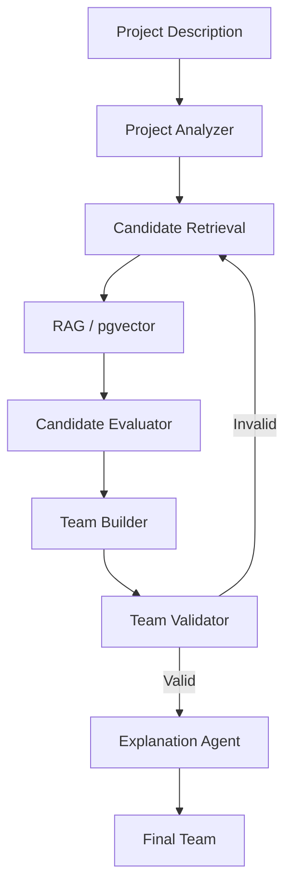

# Build: AI-Powered Employee Team Builder

Build a complete working prototype of an **Agentic AI + RAG system for intelligent project team formation**.

This is a **placement assessment project**, not a production application. Prioritize demonstrating the AI architecture, RAG pipeline, agentic workflow, and clean UI. Do not over-engineer authentication, deployment, infrastructure, monitoring, or enterprise features.

---

# 1. Core Concept

The application allows an HR user to maintain a small database of employee resumes.

The HR user then enters a project description such as:

> "Build an AI-powered customer support platform using React, FastAPI, PostgreSQL and AWS. The project requires a team of 5 people with a technical lead, two backend developers, one frontend developer and one ML engineer."

The system should:

1. Analyze the project description.
2. Extract structured project requirements.
3. Search the employee knowledge base using RAG.
4. Retrieve relevant candidates.
5. Evaluate candidates against the project requirements.
6. Construct a team that satisfies the requirements.
7. Validate the generated team.
8. If requirements are not satisfied, retrieve/reconsider candidates and rebuild the team.
9. Generate an explanation for why each selected employee was chosen.
10. Display the entire agentic workflow in the frontend.

The key selling point is:

**The system does not simply perform semantic resume search. It uses multiple agents/tools in a workflow to reason about project requirements and compose a team.**

---

# 2. Technology Stack

Use:

## Backend

* Python
* FastAPI
* SQLAlchemy
* PostgreSQL
* pgvector
* Pydantic
* LangGraph
* LLM API through an environment variable
* Embedding model/API through an environment variable
* PyMuPDF for PDF resume parsing

## Frontend

* Next.js
* TypeScript
* Tailwind CSS
* shadcn/ui
* Lucide icons

Keep the implementation simple and readable.

Do not introduce Redis, Celery, Kubernetes, microservices, authentication systems, cloud infrastructure, or other unnecessary production components.

---

# 3. Repository Structure

Create a clean monorepo:

```text
ai-team-builder/
│
├── backend/
│   ├── app/
│   │   ├── main.py
│   │   ├── config.py
│   │   │
│   │   ├── db/
│   │   │   ├── database.py
│   │   │   └── models.py
│   │   │
│   │   ├── schemas/
│   │   │   ├── employee.py
│   │   │   ├── project.py
│   │   │   └── team.py
│   │   │
│   │   ├── api/
│   │   │   ├── employees.py
│   │   │   └── team_builder.py
│   │   │
│   │   ├── rag/
│   │   │   ├── embeddings.py
│   │   │   ├── ingestion.py
│   │   │   └── retrieval.py
│   │   │
│   │   ├── agents/
│   │   │   ├── state.py
│   │   │   ├── project_analyzer.py
│   │   │   ├── candidate_retriever.py
│   │   │   ├── candidate_evaluator.py
│   │   │   ├── team_builder.py
│   │   │   ├── team_validator.py
│   │   │   ├── explanation.py
│   │   │   └── workflow.py
│   │   │
│   │   └── services/
│   │       └── employee_service.py
│   │
│   ├── requirements.txt
│   ├── .env.example
│   └── seed.py
│
├── frontend/
│   ├── app/
│   │   ├── page.tsx
│   │   ├── employees/
│   │   │   └── page.tsx
│   │   ├── employees/[id]/
│   │   │   └── page.tsx
│   │   └── team-builder/
│   │       └── page.tsx
│   │
│   ├── components/
│   │   ├── EmployeeCard.tsx
│   │   ├── AgentWorkflow.tsx
│   │   ├── CandidateCard.tsx
│   │   ├── TeamMemberCard.tsx
│   │   ├── SkillCoverage.tsx
│   │   └── ProjectRequirements.tsx
│   │
│   └── ...
│
├── docker-compose.yml
└── README.md
```

Adjust the structure if necessary, but maintain clear separation between RAG, agents, API, database, and frontend.

---

# 4. Database

Use PostgreSQL with pgvector.

Keep the schema small.

## Employee

```text
employees
---------
id
name
email
role
department
years_experience
resume_filename
resume_text
created_at
```

## Skills

```text
skills
------
id
name
```

## Employee Skills

```text
employee_skills
---------------
employee_id
skill_id
proficiency
years_experience
```

## Projects

```text
projects
--------
id
name
description
domain
```

## Employee Projects

```text
employee_projects
-----------------
employee_id
project_id
role
description
```

## Document chunks

```text
document_chunks
---------------
id
employee_id
content
embedding
metadata
```

Use pgvector for `embedding`.

Do not build a complicated enterprise database.

---

# 5. Resume Ingestion

Implement:

```text
PDF
 ↓
PyMuPDF
 ↓
Raw text
 ↓
LLM structured extraction
 ↓
Employee profile
 ↓
PostgreSQL
 ↓
Chunk resume/project information
 ↓
Generate embeddings
 ↓
pgvector
```

When an HR user uploads a resume, extract:

```json
{
  "name": "...",
  "role": "...",
  "years_experience": 4,
  "skills": [
    {
      "name": "Python",
      "proficiency": "advanced",
      "years": 4
    }
  ],
  "projects": [
    {
      "name": "...",
      "domain": "...",
      "description": "...",
      "technologies": ["Python", "AWS"]
    }
  ],
  "certifications": [],
  "education": []
}
```

Store the structured information.

Also retain the original extracted resume text for RAG.

---

# 6. Seed Data

The prototype must work immediately without requiring the evaluator to upload resumes.

Create approximately **15–20 realistic fictional employees** with different profiles.

Examples:

```text
Employee A
Senior Backend Engineer
Python, FastAPI, PostgreSQL, AWS
Payment systems
5 years

Employee B
Frontend Engineer
React, TypeScript, Next.js
E-commerce
4 years

Employee C
ML Engineer
Python, PyTorch, LLM, RAG
NLP
3 years

Employee D
QA Engineer
Selenium, Playwright, API testing
4 years

Employee E
Full Stack Engineer
React, Node.js, PostgreSQL, AWS
5 years
```

Create enough variation that the team-building workflow actually has to select among candidates.

Include:

* backend developers
* frontend developers
* full-stack developers
* ML engineers
* QA engineers
* DevOps engineers
* technical leads
* data engineers

Also give employees different project histories and domains.

Create a seed command:

```bash
python seed.py
```

The seed should populate PostgreSQL and generate embeddings.

---

# 7. Skill Normalization

Implement basic skill normalization.

For example:

```text
ReactJS → React
React.js → React
React JS → React

Postgres → PostgreSQL
PostgreSQL DB → PostgreSQL

AWS Cloud → AWS
Amazon Web Services → AWS
```

Do not build a huge ontology.

A simple alias dictionary is sufficient.

---

# 8. RAG Pipeline

Implement hybrid retrieval.

The system should combine:

### Structured filtering

Use PostgreSQL for things such as:

```text
role
years of experience
department
skills
```

### Semantic retrieval

Use pgvector to find semantically relevant resume/project chunks.

Example:

````text
Project:
"Build an online payment processing platform."

The vector search should be able to retrieve:

"Worked on Razorpay payment integration..."

even if the exact words from the project description do not appear in the resume.

---

# 9. Agentic Workflow

Use LangGraph.

Create a state object similar to:

```python
class TeamBuilderState(TypedDict):
    project_description: str
    requirements: dict
    candidates: list
    evaluations: list
    selected_team: list
    validation: dict
    iteration: int
    final_explanation: str
````

The workflow should be:

```text
START
  ↓
Project Analyzer
  ↓
Candidate Retriever
  ↓
Candidate Evaluator
  ↓
Team Builder
  ↓
Team Validator
  ↓
   ┌───────────────┐
   │               │
 INVALID          VALID
   │               │
   ↓               ↓
Retriever      Explanation
again              │
   │               ↓
   └──────────→    END
```

Limit retries to approximately 2–3 iterations.

Do not create an uncontrolled agent loop.

---

# 10. Agent 1 — Project Analyzer

Input:

```text
Natural language project description
```

Output structured JSON:

```json
{
  "team_size": 5,
  "roles": [
    {
      "role": "technical_lead",
      "count": 1
    },
    {
      "role": "backend_developer",
      "count": 2
    },
    {
      "role": "frontend_developer",
      "count": 1
    },
    {
      "role": "ml_engineer",
      "count": 1
    }
  ],
  "required_skills": [
    "React",
    "FastAPI",
    "PostgreSQL",
    "AWS",
    "LLM"
  ],
  "preferred_skills": [],
  "domain": "customer support"
}
```

Use structured Pydantic output.

---

# 11. Agent 2 — Candidate Retrieval

Create tools:

```python
search_employees()
search_by_skill()
semantic_resume_search()
get_employee_profile()
```

The agent should retrieve a candidate pool based on the project requirements.

Use a combination of:

```text
structured filters
+
vector search
```

Return perhaps 8–15 candidates.

For each candidate, include the evidence retrieved from their resume/project history.

Example:

```json
{
  "employee_id": 4,
  "name": "Employee A",
  "role": "Backend Engineer",
  "evidence": [
    "Built payment processing APIs using FastAPI",
    "3 years PostgreSQL experience",
    "Deployed services on AWS"
  ]
}
```

---

# 12. Agent 3 — Candidate Evaluator

Evaluate each candidate against the project.

Return structured output:

```json
{
  "employee_id": 4,
  "role_fit": 0.94,
  "skill_fit": 0.91,
  "experience_fit": 0.88,
  "domain_fit": 0.85,
  "overall_fit": 0.90,
  "strengths": [
    "Strong FastAPI experience",
    "AWS production experience",
    "Payment-domain experience"
  ],
  "gaps": [
    "Limited React experience"
  ],
  "evidence": [
    "Payment Gateway project",
    "AWS deployment experience"
  ]
}
```

The evaluation must be grounded in retrieved resume information.

Do not allow the LLM to invent experience.

---

# 13. Agent 4 — Team Builder

Build the team based on the evaluated candidates.

The team builder must consider the team as a whole.

For example:

```text
Required:

1 technical lead
2 backend
1 frontend
1 ML

Skills:

FastAPI
React
AWS
PostgreSQL
LLM
```

Do not simply select the five highest individual scores.

The selected team should maximize:

```text
role coverage
+
skill coverage
+
experience fit
+
domain relevance
```

while satisfying:

```text
team size
required roles
required skills
```

A simple deterministic algorithm is acceptable here.

For example:

1. Satisfy mandatory roles.
2. Select candidates with highest relevant fit for each role.
3. Check overall skill coverage.
4. Replace redundant candidates when another candidate fills a missing skill.
5. Return final team.

Do not over-engineer this with mathematical optimization unless it is genuinely useful.

---

# 14. Agent 5 — Team Validator

Validate the generated team.

Return:

```json
{
  "valid": true,
  "team_size_valid": true,
  "roles_valid": true,
  "required_skills": {
    "React": true,
    "FastAPI": true,
    "PostgreSQL": true,
    "AWS": true,
    "LLM": true
  },
  "missing_requirements": []
}
```

If invalid:

```json
{
  "valid": false,
  "missing_requirements": [
    "No candidate with strong QA experience"
  ]
}
```

The LangGraph workflow should then return to candidate retrieval and attempt another team.

Maximum 2–3 iterations.

---

# 15. Agent 6 — Explanation Agent

Generate the final human-readable result using only the structured candidate evaluations and retrieved evidence.

For each employee:

```text
Employee A
Technical Lead

Why selected:
- 5 years backend experience
- Led multiple engineering projects
- Strong AWS experience
- Previous payment-system project

Relevant skills:
Python
FastAPI
AWS
PostgreSQL

Potential gap:
Limited frontend experience
```

Also produce a team-level summary:

```text
Team strengths:
- Strong backend capability
- AWS experience
- Previous relevant domain experience
- Complete role coverage

Skill coverage:
React ✓
FastAPI ✓
PostgreSQL ✓
AWS ✓
LLM ✓
```

---

# 16. Frontend

Build only three primary pages.

## Page 1 — Dashboard

Simple landing page.

Show:

```text
AI Team Builder

Employees
20

Projects
5

Create Project
```

Include a prominent:

```text
Build a Team
```

button.

---

# 17. Employees Page

Display employees in cards/table.

Each employee:

```text
Employee A
Senior Backend Engineer

Python
FastAPI
PostgreSQL
AWS

5 years experience
```

Allow:

```text
Add Employee
View Employee
```

The Add Employee flow should allow:

```text
Name
Role
Department
Resume PDF
```

Then show extracted information before saving.

---

# 18. Team Builder Page

This is the primary screen.

Create:

```text
Project Description

┌─────────────────────────────────────────┐
│ Describe the project...                 │
│                                         │
│                                         │
└─────────────────────────────────────────┘

Team Size: [ 5 ]

[ Build Team ]
```

When Build Team is clicked, display the agent workflow.

---

# 19. Agent Workflow UI

Show the workflow executing live.

Example:

```text
AI TEAM BUILDER

✓ Project Analyzer
  Extracted 5 roles and 6 required skills

✓ Candidate Retrieval
  Retrieved 12 relevant employees

✓ Candidate Evaluation
  Evaluated 12 candidates

✓ Team Builder
  Constructed candidate team

✓ Team Validator
  All project requirements satisfied

✓ Explanation Agent
  Generated team analysis
```

While executing, show an animated active state.

This is important because the evaluator should visually understand that this is an agentic pipeline.

---

# 20. Result UI

Display:

```text
Recommended Team

┌─────────────────────────────────────┐
│ Employee A                          │
│ Technical Lead                      │
│                                     │
│ Project Fit: 92%                    │
│                                     │
│ Python  AWS  FastAPI  PostgreSQL    │
│                                     │
│ Why selected                        │
│ Strong backend and AWS experience   │
│ with previous payment projects.     │
└─────────────────────────────────────┘
```

Repeat for each selected employee.

Then show:

```text
Team Skill Coverage

React          ✓
FastAPI        ✓
PostgreSQL     ✓
AWS            ✓
LLM            ✓
```

And:

```text
Project Requirements

Technical Lead       ✓
Backend × 2          ✓
Frontend              ✓
ML Engineer           ✓
```

---

# 21. Show RAG Evidence

This is important for demonstrating RAG.

Every candidate card should have an expandable:

```text
View Evidence
```

which displays snippets retrieved from their resume/project history.

Example:

```text
Retrieved evidence

"Developed a payment processing service using FastAPI,
PostgreSQL and AWS..."

Source:
Employee A — Payment Gateway Project
```

This demonstrates that the recommendation is grounded in the employee knowledge base.

---

# 22. API Endpoints

Implement only the necessary endpoints.

```text
POST /api/employees
GET  /api/employees
GET  /api/employees/{id}

POST /api/employees/upload-resume

POST /api/team-builder/analyze
POST /api/team-builder/run
```

The main endpoint:

```text
POST /api/team-builder/run
```

should accept:

```json
{
  "project_description": "...",
  "team_size": 5
}
```

and return:

```json
{
  "requirements": {},
  "candidates": [],
  "evaluations": [],
  "team": [],
  "validation": {},
  "explanation": ""
}
```

For the live workflow UI, either use Server-Sent Events or a simple polling mechanism. Prefer SSE if straightforward; otherwise return workflow stages and animate them on the frontend.

---

# 23. Demo Scenario

Make sure the seeded database supports this exact demo.

Project:

> Build an AI-powered customer support platform for an e-commerce company. The backend should use Python/FastAPI and PostgreSQL. The frontend should use React. The system will use an LLM and RAG for automated customer support. Deploy the application on AWS. Build a team of 6 consisting of a technical lead, two backend engineers, one frontend engineer, one ML engineer and one QA engineer.

The system should be able to:

```text
Analyze project
      ↓
Extract roles
      ↓
Extract skills
      ↓
Retrieve employees
      ↓
Retrieve resume evidence
      ↓
Evaluate candidates
      ↓
Build team
      ↓
Validate team
      ↓
Explain selections
```

Make the seeded employee data intentionally varied so that the workflow has meaningful choices.

---

# 24. Important AI Design Requirement

Do not create fake agent behavior.

Avoid:

```python
print("Agent searching...")
sleep(2)
print("Agent evaluating...")
sleep(2)
```

while doing everything with one LLM call.

The backend should actually execute distinct workflow nodes:

```text
Project Analyzer
Candidate Retriever
Candidate Evaluator
Team Builder
Team Validator
Explanation
```

The frontend workflow visualization should correspond to actual backend workflow stages.

---

# 25. LLM prompts

Keep agent prompts in separate files/modules rather than embedding huge strings throughout the application.

Use structured outputs wherever possible.

The LLM should be explicitly instructed:

* Do not invent employee experience.
* Use only retrieved employee information.
* Distinguish required skills from preferred skills.
* Consider team-level coverage.
* Return structured JSON.
* Explain decisions using evidence.

---

# 26. Error handling

Implement basic handling for:

* Invalid PDF
* Empty resume
* LLM failure
* Embedding failure
* No matching candidates
* Impossible team requirements
* Invalid LLM JSON

If no feasible team exists, return:

```text
No feasible team found.

Missing requirements:
- AWS experience
- QA experience
```

Do not fabricate a team.

---

# 27. UI Design

Use a clean modern SaaS dashboard aesthetic.

Prefer:

* white/light background
* dark text
* subtle borders
* rounded cards
* restrained use of color
* clean typography
* clear hierarchy
* compact spacing
* Lucide icons

The application should look like a serious internal enterprise AI tool, not a flashy AI demo.

Do not add unnecessary animations or visual effects.

---

# 28. README

Create a detailed README explaining:

```text
1. Problem
2. Solution
3. Architecture
4. RAG pipeline
5. Agentic workflow
6. Database design
7. Technologies
8. Setup
9. Running the application
10. Demo example
```

Include an architecture diagram using Mermaid.

Example:



---

# 29. Environment Variables

Create:

```text
DATABASE_URL=
LLM_API_KEY=
LLM_MODEL=
EMBEDDING_MODEL=
```

Create `.env.example`.

Do not hardcode API keys.

---

# 30. Development Priority

Build in this exact order:

```text
1. PostgreSQL + pgvector
2. Employee database
3. Seed fictional employees
4. Resume parser
5. Structured resume extraction
6. Embedding + RAG retrieval
7. Project Analyzer
8. Candidate Retrieval
9. Candidate Evaluation
10. Team Builder
11. Team Validator
12. Explanation Agent
13. LangGraph workflow
14. FastAPI endpoint
15. Next.js UI
16. Live workflow visualization
17. Final team result UI
18. README
```

At every stage, keep the application runnable.

---

# 31. Most Important Requirement

The final prototype must clearly demonstrate this distinction:

### Normal RAG

```text
Project description
       ↓
Search resumes
       ↓
Return relevant employees
```

### This project

```text
Project description
       ↓
Analyze requirements
       ↓
Retrieve candidates
       ↓
Evaluate candidates against requirements
       ↓
Compose a team
       ↓
Check whether the team satisfies constraints
       ↓
If necessary, retrieve/reconsider candidates
       ↓
Generate evidence-backed explanation
```

The second workflow is the centerpiece of the project.

Do not expand the scope beyond this unless required to make the prototype functional.
